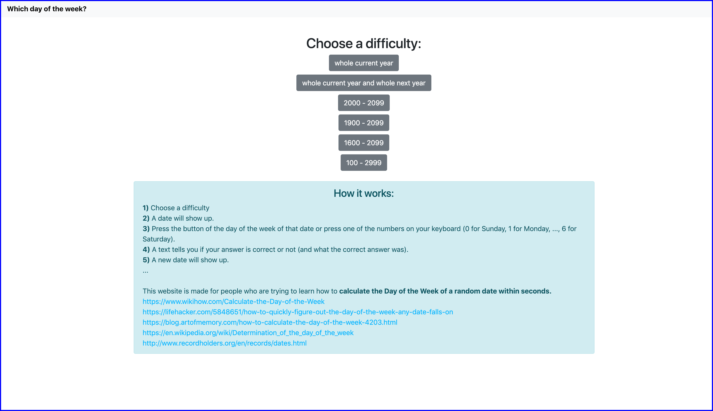
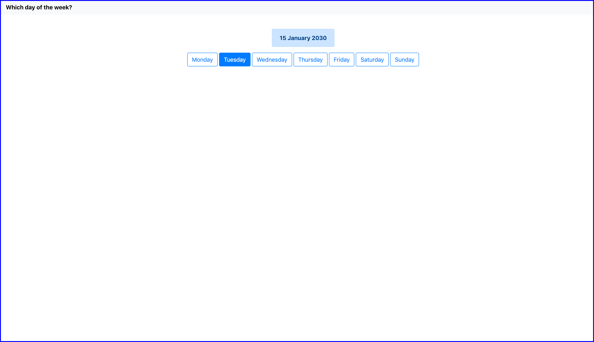
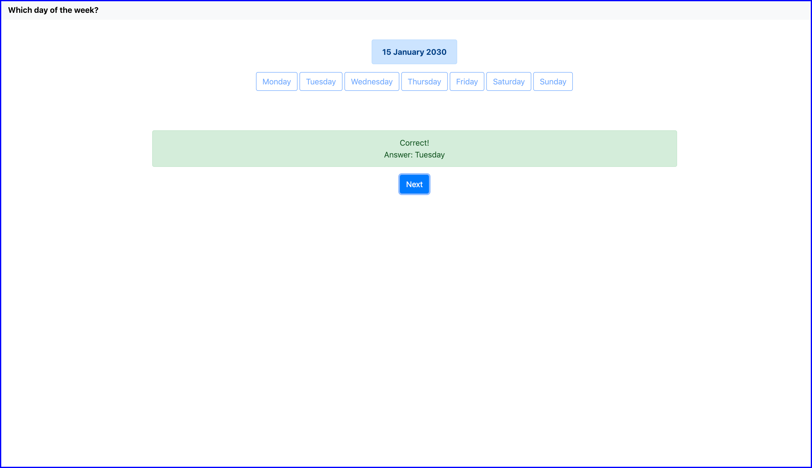
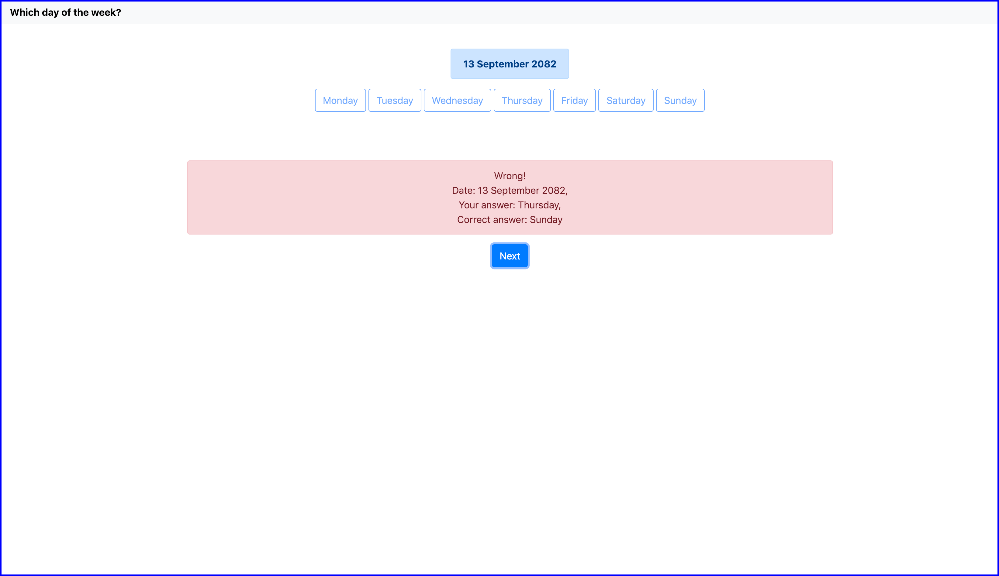

# Which-day-of-the-week

Which day of the week is made for people who are trying to learn how to calculate the Day of the Week of a random date within seconds. 
It's a node-js based website you can run in your browser.

## Demo

[https://ndsvw.github.io/Which-day-of-the-week/](https://ndsvw.github.io/Which-day-of-the-week/)

## Usage

Open the index.html file in your browser.

## Preview

